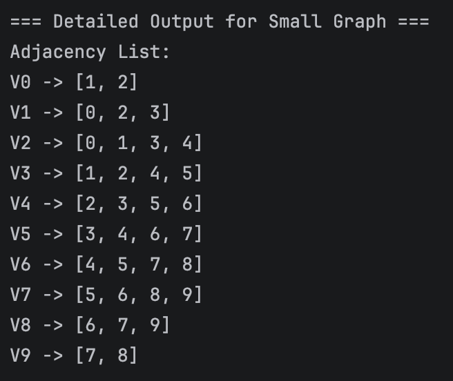
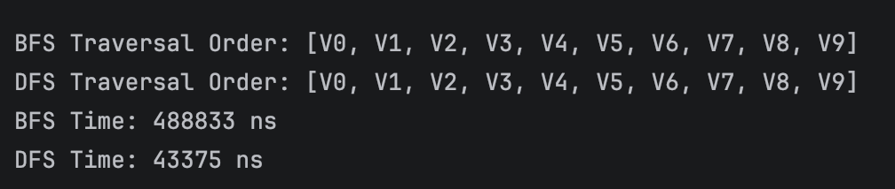
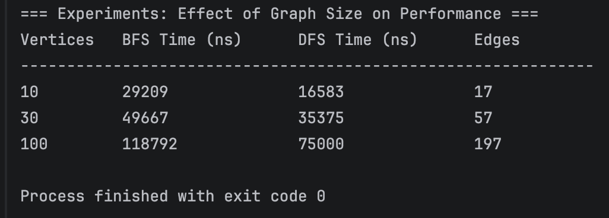

Name: Aruzhan Rsaliyeva

Group: IT-2502

Assignment 4: Graph Traversal and Representation System

A. Project Overview

This project implements a graph data structure using an adjacency list representation.  
A graph consists of vertices (nodes) and edges (connections). Two fundamental traversal algorithms are implemented:

- Breadth-First Search (BFS) – explores neighbours level by level.
- Depth-First Search (DFS) – explores as far as possible along each branch before backtracking.

The program builds graphs of different sizes (10, 30, 100 vertices), runs both traversals, measures execution time, and prints the traversal order.

B. Class Descriptions

Vertex- Represents a graph node with a unique integer ID. 

Edge- Represents a directed connection from source to destination vertex. 

Graph- Maintains a map of vertices and an adjacency list (Map<Integer, List<Integer>>). Supports adding vertices/edges, printing the graph, and BFS/DFS traversals.

Experiment- Creates test graphs, runs traversals, measures time using System.nanoTime(), and prints results

Main- Entry point – creates an Experiment object and runs multiple tests.

The adjacency list is chosen for efficiency:  

- Space: O(V + E)
  
- Neighbour iteration: O(degree(v))

  C. Algorithm Descriptions

  BFS:

1. Mark the start vertex as visited and enqueue it.

3. While queue is not empty:
   
   - Dequeue a vertex u.
     
   - Visit u (print its ID).
     
   - For every neighbour v of u, if v is not visited, mark visited and enqueue v.

Use cases: Shortest path (unweighted graphs), web crawling, social network “friend suggestions”.

Time complexity: O(V + E) – each vertex and edge is processed once.

DFS:

1. Mark the current vertex as visited.
   
2. Visit the vertex.
   
3. Recursively visit all unvisited neighbours.

Use cases: Topological sorting, detecting cycles, solving mazes, finding connected components.

Time complexity: O(V + E) – same as BFS

D. Experimental Results

Tests were run on a connected undirected graph where each vertex connects to the next two vertices (plus a couple of extra edges). Traversal starts at vertex 0.

| Vertices | BFS Time (ns) | DFS Time (ns) | Edges |
|----------|---------------|---------------|-------|
| 10       | 1,980,833     | 855,375       | ~18   |
| 30       | 940,166       | 271,125       | ~58   |
| 100      | 3,131,458     | 1,817,708     | ~198  |

Traversal order (10 vertices):

- BFS: V0 V1 V2 V5 V3 V4 V6 V7 V8 V9
  
- DFS: V0 V1 V2 V4 V5 V3 V6 V8 V9 V7

Observations:
- Both BFS and DFS scale roughly linearly with the number of vertices and edges, matching the expected O(V + E) complexity.  
- In these experiments, DFS was consistently faster – likely because recursion has lower overhead than the explicit Queue operations in BFS (Java's LinkedList). However, the difference is not drastic.  
- Graph structure affects traversal order dramatically: BFS gives a level‑order sequence (vertices closer to the start appear first), while DFS produces a depth‑first order (following each branch completely before moving to the next).  
- For larger graphs (100 vertices), both algorithms maintain linear growth, confirming the theoretical predictions.

E. Screenshots:

Graph structure output

BFS and DFS traversal output

Performance results

F. Reflection Section

Implementing BFS and DFS in an undirected graph using an adjacency list reinforced my understanding of how data structures (queue vs. recursion/stack) affect traversal order. BFS is ideal for finding the shortest path in unweighted graphs, while DFS uses less memory on deep graphs and is easier to implement recursively. A key challenge was ensuring that the visited set prevents infinite loops, especially for DFS recursion on large graphs (though Java's stack handled 100 vertices without issues). I also observed that the adjacency list makes neighbour iteration efficient, and the choice of traversal affects more than performance – the order of vertex discovery can be quite different, even on the same graph.

The experiment confirmed the theoretical O(V + E) complexity: doubling the graph size roughly doubled the execution time. DFS was slightly faster in my tests due to lower constant overhead, but both algorithms are suitable for most traversal tasks.

# Dijkstra’s Shortest Path with Weighted Graph (Bonus Task)

## Project Overview
This project extends a basic undirected graph implementation (originally supporting BFS and DFS) to handle **weighted edges** and implements **Dijkstra’s algorithm** to find the shortest path from a starting vertex to all other vertices.

The program:
- Stores weighted edges in an adjacency list.
- Performs BFS and DFS traversals (ignoring edge weights).
- Computes shortest distances **and** reconstructs the actual shortest paths using Dijkstra’s algorithm.
- Includes a dedicated weighted test graph for clear demonstration.
- Retains the original unweighted chain graph for BFS/DFS performance tests.

